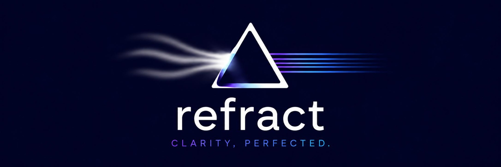
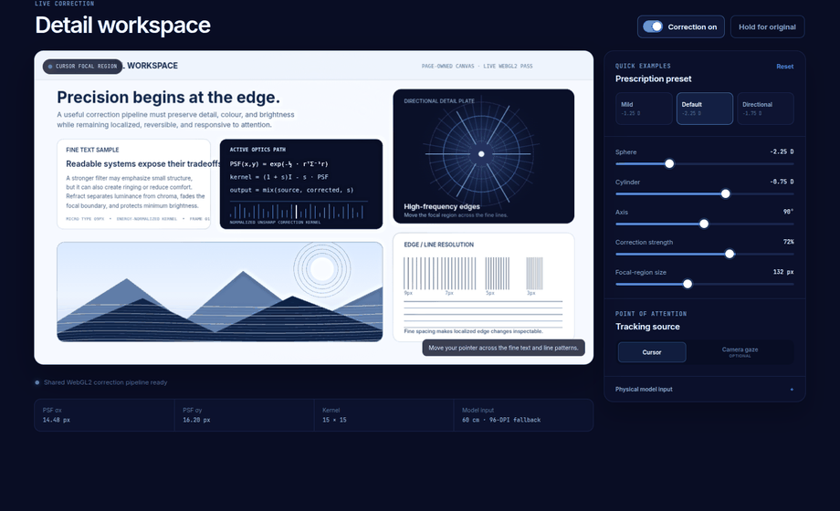
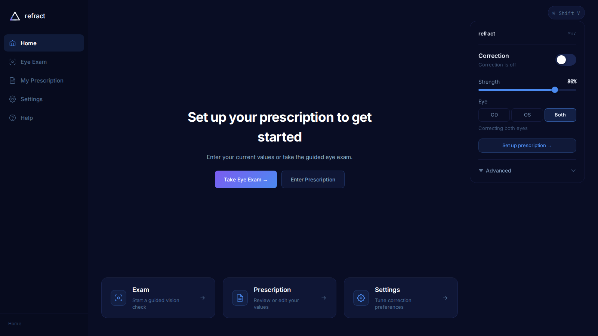
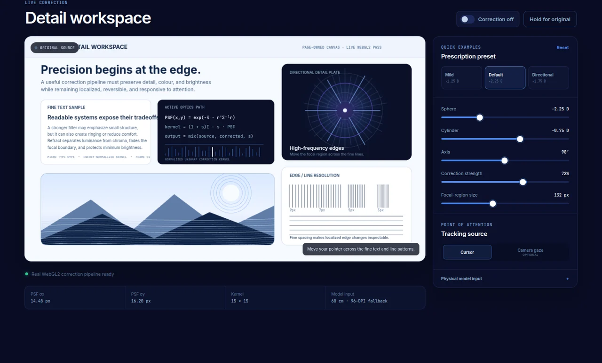
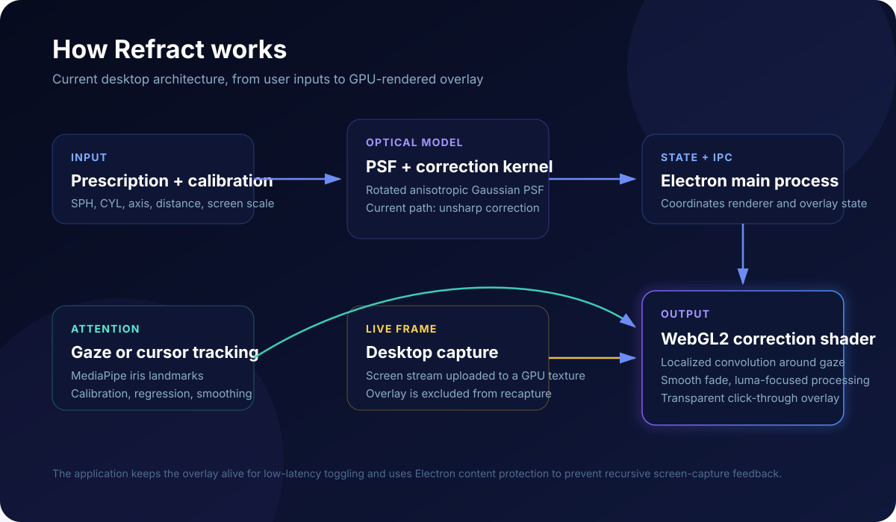
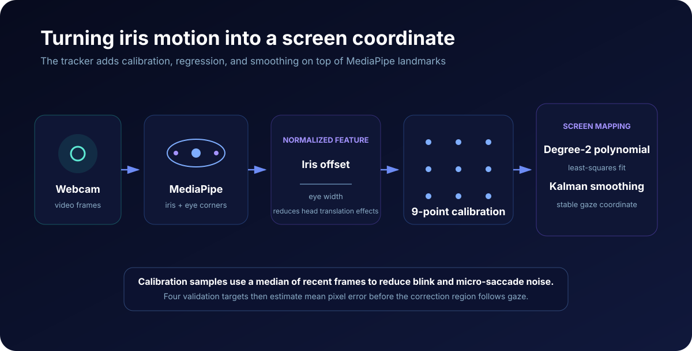
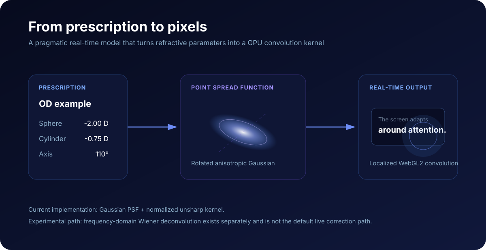
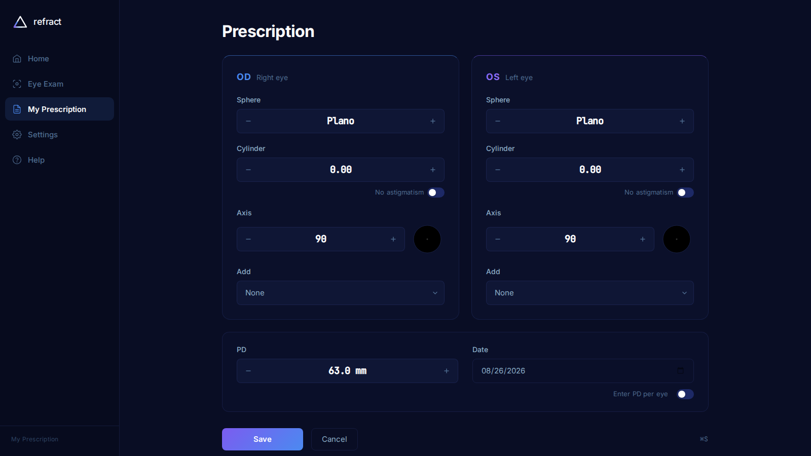
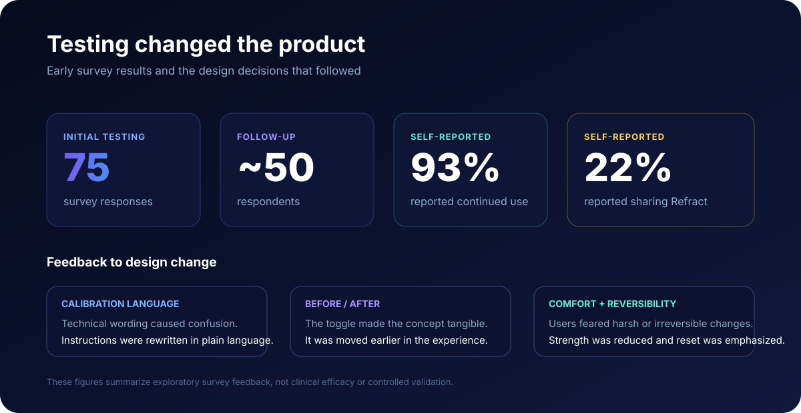

<p align="center">
  
</p>

<p align="center">
  <strong>An experimental adaptive-display prototype combining computational optics, gaze tracking, physical calibration, and real-time GPU rendering.</strong>
</p>

<p align="center">
  Electron · React · TypeScript · WebGL2 · GLSL · MediaPipe · Zustand
</p>

<p align="center">
  <a href="https://refract-portfolio.vercel.app"><strong>Try the interactive browser demo</strong></a>
  &nbsp;·&nbsp;
  <a href="#system-architecture"><strong>Explore the engineering</strong></a>
  &nbsp;·&nbsp;
  <a href="#contribution-and-collaboration"><strong>Contribution</strong></a>
</p>

<p align="center">
  <a href="https://github.com/kzhu37/Refract-Portfolio/actions/workflows/ci.yml"></a>
  <a href="https://github.com/kzhu37/Refract-Portfolio/actions/workflows/production-smoke.yml"></a>
</p>

Refract asks a simple question: **what if a display could adapt to the user's vision instead of making the user adapt to the display?**

The full Electron prototype captures desktop content, builds an approximate refractive-blur model from prescription and physical calibration parameters, follows a cursor or calibrated gaze estimate, and applies localized GPU correction around the point of attention. Making that loop usable turned the project into an integration problem across optics, numerical methods, computer vision, desktop capture, WebGL, physical geometry, and human comfort.

> [!IMPORTANT]
> **Refract is an experimental research and engineering prototype.** It is not a medical device, clinical diagnostic tool, prescription estimator, or replacement for glasses, contact lenses, professional eye examinations, or other vision care. The guided workflow produces heuristic prototype inputs only.

<p align="center">
  
</p>
<p align="center"><sub><strong>Live renderer evidence:</strong> captured from the real browser build. The pointer moves the localized correction region, the demo switches to a directional prescription, and the original source is briefly revealed for comparison.</sub></p>

> [!NOTE]
> **Collaborative project:** Refract's core prototype was developed with Vlad Duckardt. My later work focused on product evaluation and feedback-driven iteration, interface and usability refinement, desktop productization, the public browser adaptation, technical documentation, and automated verification. The original source history and specific contribution record are preserved in [Contribution and collaboration](#contribution-and-collaboration).

<table>
  <tr>
    <td width="50%">
      
    </td>
    <td width="50%">
      
    </td>
  </tr>
  <tr>
    <td align="center"><sub><strong>Full desktop prototype:</strong> capture, calibration, persistent settings, tray controls, shortcuts, and a transparent correction overlay.</sub></td>
    <td align="center"><sub><strong>Public browser demo:</strong> the same browser-compatible optical model and WebGL2 renderer applied only to page-owned content.</sub></td>
  </tr>
</table>

<p align="center">
  <a href="#at-a-glance">Overview</a> ·
  <a href="#system-architecture">Architecture</a> ·
  <a href="#gaze-tracking-and-calibration">Gaze</a> ·
  <a href="#modeling-refractive-blur">Optics</a> ·
  <a href="#interactive-browser-demo">Demo</a> ·
  <a href="#testing-changed-the-product">Iteration</a> ·
  <a href="#verification-and-evidence-boundaries">Verification</a> ·
  <a href="#contribution-and-collaboration">Contribution</a>
</p>

## At a glance

| Area | Current prototype |
| --- | --- |
| **Core idea** | Preprocess display content so the screen can partially compensate for modeled visual blur |
| **Technical centerpiece** | A gaze-aware or cursor-aware WebGL2 correction region rendered through a transparent, click-through Electron overlay |
| **Optical model** | Sphere, cylinder, axis, viewing distance, screen scale, and pupil assumptions become a rotated anisotropic Gaussian point spread function |
| **Tracking** | MediaPipe iris landmarks, eye-relative features, 3 x 3 calibration grid, degree-2 polynomial mapping, validation, and Kalman smoothing |
| **Desktop systems** | Screen capture, protected overlay, IPC, persistence, tray controls, global shortcuts, and packaging |
| **Live renderer contract** | The active GPU path accepts validated odd kernels up to 15 x 15; larger kernels remain experimental or offline only |
| **Verification** | 13 deterministic numerical and calibration checks, TypeScript checks, desktop and browser builds, and deployed interaction smoke tests |
| **Kevin's focus** | Product evaluation and iteration, interface and usability refinement, desktop productization, public browser adaptation, technical documentation, and verification |
| **Project type** | Collaborative experimental engineering prototype with later public refinement |

## Why Refract

Glasses correct light after it leaves a display. Refract explores the inverse engineering idea: whether displayed content can be preprocessed so some modeled optical blur is partially compensated before the image reaches the eye.

A useful prototype had to connect pixels to physical screen dimensions, account for viewing distance, translate prescription values into directional blur, follow a point of attention, process changing desktop content continuously, prevent its own overlay from feeding back into screen capture, control artifacts, and remain comfortable enough to test.

That created six connected engineering problems:

- **Computational optics:** convert refractive and physical parameters into an approximate point spread function.
- **Computer vision:** turn webcam iris landmarks into a calibrated screen coordinate.
- **Numerical methods:** fit mappings, condition noisy data, smooth predictions, and generate bounded kernels.
- **GPU graphics:** convolve live content around the point of attention without processing the entire screen unnecessarily.
- **Desktop engineering:** coordinate Electron windows, capture, IPC, persistence, tray controls, shortcuts, and packaging.
- **Human-centered iteration:** treat comprehension, reversibility, setup conditions, and comfort as engineering constraints.

## System architecture

<p align="center">
  
</p>

Refract separates the application interface from the high-frequency correction layer because they have different performance and interaction requirements.

- The **React renderer** handles prescription input, calibration, the guided workflow, settings, and user controls.
- The **Electron main process** owns windows, screen-capture coordination, persistence, tray behavior, global shortcuts, and IPC.
- The **overlay renderer** receives compact correction state and runs a WebGL render loop without forcing React component re-renders.
- The **tracking pipeline** supplies a cursor position or calibrated gaze estimate.
- The **optics pipeline** converts refractive and physical parameters into PSF and correction kernels that can be serialized through IPC.

### Preventing recursive desktop capture

The correction layer is a separate frameless, transparent, always-on-top Electron window. It is normally non-focusable and click-through, so corrected content can appear above another application without intercepting normal mouse input.

The difficult part is feedback. If desktop capture includes Refract's own overlay, the next frame can contain the previous corrected output. Reprocessing that output creates a recursive loop. [`overlay-window.ts`](src/main/windows/overlay-window.ts) uses Electron content protection so the overlay remains visible to the user while being excluded from capture APIs.

The high-frequency path lives in [`CorrectionCanvas.tsx`](src/overlay/CorrectionCanvas.tsx), [`webgl-utils.ts`](src/overlay/lib/webgl/webgl-utils.ts), and [`correction-shader.ts`](src/overlay/lib/webgl/correction-shader.ts).

The active shader keeps **optical correction separate from magnification**. The focal region applies the correction kernel to the original sampling coordinates rather than quietly enlarging the image. It also:

- fades correction smoothly outside the focal region instead of ending at a hard boundary
- changes luminance while retaining source chroma to reduce color fringing
- applies a conservative brightness floor to limit darkening from negative kernel sidelobes
- leaves pixels outside the active region transparent
- rejects non-finite gaze coordinates before they can contaminate shader state
- renders nothing when no valid correction kernel is available instead of simulating activity with a brightness-only effect

A mathematically stronger filter is not automatically a better human-facing result. Artifact control and comfort are part of correctness.

## Gaze tracking and calibration

<p align="center">
  
</p>

Cursor tracking is the default because it works immediately and requires no camera. Eye tracking is optional and adds a harder calibration problem.

MediaPipe Face Mesh supplies iris and eye-corner landmarks, but Refract does not treat those landmarks as a finished gaze estimate. In [`iris-gaze.ts`](src/renderer/lib/eyetracking/iris-gaze.ts), each iris center is measured **relative to the midpoint and width of its eye corners**. That eye-relative feature reduces sensitivity to head translation and viewing-distance changes compared with regressing directly on raw camera pixels. It does not make the tracker invariant to head pose, lighting, camera position, or individual eye geometry.

Desktop calibration uses a 3 x 3 screen grid. Each target records the median of several recent feature samples to reduce the influence of blinks and small involuntary movements. Refract then builds degree-2 polynomial features:

```text
[1, x, y, x^2, xy, y^2]
```

Separate horizontal and vertical mappings are fitted with least squares. The normal equations are solved by a custom Gauss-Jordan routine with partial pivoting, while feature centering and scaling improve numerical conditioning. Runtime predictions pass through the constant-velocity Kalman smoother in [`gaze-smoother.ts`](src/renderer/lib/eyetracking/gaze-smoother.ts).

Four validation targets estimate mean screen-space error. Refract reports that directly rather than assigning a fabricated physiological tracking-confidence score. Recalibration remains available when the correction region drifts.

## Modeling refractive blur

<p align="center">
  
</p>

The active model is deliberately pragmatic. Refract converts prescription and calibration values into display-space blur scales using viewing distance, screen pixel density, and a pupil assumption. Sphere contributes base blur, while cylinder and axis create directional behavior. The result is a **rotated anisotropic Gaussian point spread function (PSF)**.

Prescription conversion is implemented in [`prescription.ts`](src/renderer/lib/optics/prescription.ts). PSF and active correction-kernel generation live in [`psf.ts`](src/renderer/lib/optics/psf.ts). The physical motivation, Gaussian approximation, heuristic boundaries, and literature context are documented in [`docs/OPTICAL_MODEL.md`](docs/OPTICAL_MODEL.md).

For each PSF sample, Refract rotates the pixel offset into the kernel's principal-axis coordinate system, evaluates a 2D Gaussian, and normalizes the kernel. The automatic live path is capped at **15 x 15**, matching the compiled shader capacity. [`correction-constants.ts`](src/shared/correction-constants.ts) defines that shared contract, and the WebGL boundary rejects oversized, even-sized, or length-mismatched kernels before upload.

### One meaning for correction strength

The active route generates one full-strength spatial unsharp kernel:

```text
K = 2I - PSF
```

The shader owns the single user-facing blend between original and corrected luminance. Keeping strength out of cached kernel generation avoids stale kernels when the slider changes and gives the control one consistent meaning.

### Experimental inversion work

[`wiener.ts`](src/renderer/lib/optics/wiener.ts) contains a separate frequency-domain Wiener experiment:

```text
W(u,v) = H*(u,v) / (|H(u,v)|^2 + NSR)
```

It pads and shifts the PSF, performs a custom separable 2D discrete Fourier transform, applies a regularized inverse, and transforms the result back into a spatial kernel. It is **not** an active runtime control. Higher-order optical representations were explored during research, but the live model remains Gaussian.

Keeping experimental work separate from active behavior is intentional. The interface should describe what the renderer actually does, not everything the codebase has explored.

## Interactive browser demo

The public demo reuses Refract's browser-compatible PSF generation, correction-kernel generation, WebGL utilities, GLSL shader, and optional iris tracker. Cursor tracking works immediately. Camera gaze is opt-in, and denial or missing hardware falls back cleanly to cursor mode.

The browser changes the input boundary, not the claimed optical pipeline. It processes only a page-owned detail canvas because a normal web page cannot capture arbitrary desktop content or place Refract's transparent overlay above other applications.

The current demo is intentionally conservative:

- no hidden magnification is applied to make correction appear stronger
- no brightness-only substitute is shown when a valid kernel is missing
- browser camera video stays in the tab and is not uploaded, recorded, or persisted
- the browser uses a documented 96-DPI physical-scale fallback because it cannot reliably know monitor pixel density
- the full 3 x 3 gaze-calibration flow remains a desktop feature

**Try it:** <https://refract-portfolio.vercel.app>

## Guided vision workflow

Refract can begin from a known prescription, but it also contains an experimental guided workflow for users who do not start with one. This is a calibration and interaction experiment, not a clinical eye examination.

<table>
  <tr>
    <td width="50%">
      
    </td>
    <td width="50%">
      
    </td>
  </tr>
  <tr>
    <td align="center"><sub>Known OD and OS values remain explicit and editable.</sub></td>
    <td align="center"><sub>Sloan-style letters are scaled from physical screen calibration rather than CSS pixels alone.</sub></td>
  </tr>
</table>

The workflow includes viewing-distance calibration, physical screen calibration using a known-size reference, Snellen-style acuity testing, astigmatism clock and fan interfaces, and contrast comparison. Its acuity-to-sphere mapping is a prototype interaction heuristic, not a validated way to infer refraction from Snellen acuity. The results screen labels the output as a guided estimate, and the active code no longer assigns a numeric confidence or error bound that the prototype has not been calibrated to support.

Physical calibration remains an important engineering constraint. A letter occupying the same number of CSS pixels can have very different real-world dimensions on two monitors, so screen geometry and viewing conditions belong inside the model rather than only in setup instructions.

## Testing changed the product

<p align="center">
  
</p>

Exploratory user testing exposed problems that code review could not reveal.

| What users revealed | Product response |
| --- | --- |
| Calibration language sounded too technical | Rewrite setup as guided instructions rather than a clinical-sounding procedure |
| The idea remained abstract until correction was toggled | Move original-versus-corrected comparison earlier |
| Users worried a poor adjustment might leave the screen worse | Make reset and reversibility more visible |
| Stronger correction could feel harsh or slightly disorienting | Reduce aggressive defaults and treat comfort as part of functionality |
| Results changed with the testing environment | Treat distance, screen scale, brightness, room lighting, and camera position as system variables |

One glasses-wearing tester described the result as **"promising, but not quite like my glasses."** That feedback was useful because it separated a visible effect from genuine effectiveness and pushed the project toward clearer limits, better setup, and more meaningful success criteria.

The testing was exploratory and subjective. It was not controlled clinical validation. Earlier presentation work included survey figures, but this public repository does not repeat those numbers because the retained material does not establish a sufficiently precise denominator, question wording, and methodology for a defensible technical claim.

## Verification and evidence boundaries

`npm test` compiles and runs 13 deterministic checks covering:

- anisotropic Gaussian normalization and invalid-input guards
- identity behavior for an emmetropic prescription
- directional response when cylinder and axis are present
- rejection of non-positive or non-finite physical blur-model inputs
- automatic live-kernel sizing against the 15 x 15 renderer contract
- rejection of oversized, even-sized, and length-mismatched live kernels
- prescription cylinder-form normalization
- single strength semantics for the active correction kernel
- Kalman gaze-smoother stability and reset behavior
- the guided workflow boundary that prevents unsupported numeric confidence scoring
- recovery of a known degree-2 gaze mapping from deterministic calibration samples
- rejection of degenerate polynomial gaze-calibration data

GitHub Actions separately type-checks the Node, renderer, and browser targets, runs the numerical suite, builds the Electron application and browser demo, verifies portfolio media and writing constraints, and exercises the deployed browser interaction.

The production smoke path requires WebGL2, checks that pointer movement changes the correction-stage output, exercises correction toggling, presets, reset behavior, responsive layout, fallback behavior, camera-consent UI, and deep-link loading, and fails on severe browser-console errors.

The CI quality gate also checks evidence discipline. It rejects broken README media references, hidden shader magnification, unsupported guided-workflow confidence scoring, hardcoded gaze confidence, overstated gaze-invariance language, and claims that frame-time monitoring already performs automatic resolution adjustment.

### Current limitations

Refract remains a proof of concept with clear boundaries:

- the live optical model uses an anisotropic Gaussian PSF, not a clinically calibrated wavefront model
- the display-space blur mapping and Gaussian representation are engineering approximations rather than a measured retinal PSF
- the experimental Wiener module remains separate from the active normalized unsharp path
- the application computes separate OD and OS optical states, but the screen-level renderer applies one selected eye profile at a time rather than simultaneous binocular per-eye correction
- guided acuity, astigmatism, and contrast stages are heuristic prototype inputs, not prescription estimation
- automatic live kernels are intentionally bounded to 15 x 15 for the current shader architecture
- frame-time monitoring exists, but automatic capture-resolution adjustment is not implemented
- MediaPipe runtime assets are loaded from a CDN
- user testing was exploratory rather than controlled clinical evaluation

The strongest next work is measurement and validation, not adding more controls: benchmark frame time and latency on defined hardware, quantify gaze-calibration error across repeated setups, compare optical models against predefined visual criteria, and expand controlled testing.

## Engineering decisions that mattered

| Challenge | Decision | Why it mattered |
| --- | --- | --- |
| Recursive screen capture | Exclude the transparent overlay from capture APIs | Prevents corrected output from feeding into the next frame |
| Noisy webcam gaze | Normalize iris position to eye geometry, collect multiple samples, fit and validate a polynomial mapping, then smooth it | Turns landmarks into a more stable screen coordinate |
| Sharpening artifacts and discomfort | Localize correction, blend the boundary, retain chroma, protect brightness, and keep defaults conservative | Treats perceptual quality as part of correctness |
| Inconsistent physical display scale | Calibrate screen scale and viewing distance | Connects screen pixels to real-world geometry |
| Renderer/model mismatch risk | Share and validate a 15 x 15 live-kernel contract | Prevents a numerical kernel from silently exceeding shader capacity |
| Demo effects that could overstate correction | Remove hidden focal magnification, brightness-only fallbacks, and simulated guided-result before/after effects | Keeps visible evidence aligned with the actual renderer |
| Prototype controls that could overstate functionality | Expose only controls wired to active runtime behavior and label heuristic outputs explicitly | Keeps the interface aligned with implementation and evidence |
| Unsupported quantitative certainty | Report measured screen-space calibration error directly and avoid invented confidence scores | Separates observable prototype behavior from claims the system has not validated |

## What I learned

**Test earlier.** Research can justify a direction, but it cannot show whether a first-time user understands the setup or finds the result comfortable.

**Design the environment, not only the interface.** Viewing distance, brightness, room lighting, camera position, and physical screen dimensions can change the result. In software connected to the physical world, setup conditions become system inputs.

**Define success before collecting feedback.** "Working" can mean visible sharpness, comfort, a measurable before/after difference, or similarity to corrective lenses. Those are different criteria and should not be collapsed into one claim.

**Technical complexity is not a substitute for clarity.** A shader, inverse-filtering experiment, or tracking model can be sophisticated while the product remains confusing.

**Credibility is an engineering property.** Runtime limits, demos, tests, numerical assumptions, and documentation should agree about what the system actually does.

## Technology

<details>
<summary><strong>Implementation stack</strong></summary>

| Area | Technology and implementation |
| --- | --- |
| Desktop application | Electron 32, Electron Vite |
| Interface | React 18, TypeScript, React Router, Tailwind CSS |
| State and persistence | Zustand, electron-store |
| GPU rendering | WebGL2, GLSL ES 3.00 |
| Computer vision | MediaPipe Face Mesh with custom iris-feature calibration |
| Gaze estimation | Degree-2 polynomial regression, custom Gauss-Jordan solver, Kalman smoothing |
| Computational optics | Directional Gaussian PSFs, normalized unsharp correction, experimental Wiener deconvolution |
| Desktop integration | IPC, transparent overlay, desktop capture, tray controls, global shortcuts |
| Packaging | Electron Builder, Windows NSIS, macOS DMG, Linux AppImage |
| Verification | TypeScript checks, deterministic numerical and calibration tests, GitHub Actions, production browser smoke testing |

</details>

## Run Refract locally

<details>
<summary><strong>Desktop development</strong></summary>

### Prerequisites

- Node.js 20 or a compatible current Node.js release
- npm
- a desktop environment supported by Electron
- a webcam only for optional eye tracking or camera-based distance estimation
- screen-capture permission where required by the operating system

```bash
git clone https://github.com/kzhu37/Refract-Portfolio.git
cd Refract-Portfolio
npm ci
npm run dev
```

Cursor tracking is the default and does not require a camera. Eye tracking requires calibration.

</details>

<details>
<summary><strong>Browser demo and verification</strong></summary>

```bash
npm run dev:web-demo
npm run typecheck
npm test
npm run build
npm run build:web-demo
```

The browser target is intentionally scoped to content inside the page. It is not a replacement for the Electron desktop overlay.

</details>

<details>
<summary><strong>Platform packaging and shortcuts</strong></summary>

```bash
npm run build:win
npm run build:mac
npm run build:linux
```

| Action | Windows / Linux | macOS |
| --- | --- | --- |
| Toggle correction | `Ctrl + Shift + V` | `Cmd + Shift + V` |
| Bring Refract forward | `Ctrl + Shift + B` | `Cmd + Shift + B` |

</details>

## Repository guide

```text
src/
  main/                 Electron windows, IPC, persistence, tray
  overlay/              Desktop capture and high-frequency WebGL renderer
  preload/              Context-isolated Electron bridges
  renderer/
    components/         Calibration, vision, and correction UI
    lib/eyetracking/     Iris tracking, polynomial calibration, smoothing
    lib/optics/          Prescription model, PSF, Wiener experiment
    lib/store/           Renderer state
    pages/               Main application screens
  shared/                Cross-layer live renderer contracts
web-demo/                Interactive browser adaptation
tests/                   Deterministic numerical and calibration verification
docs/
  OPTICAL_MODEL.md       Model assumptions, evidence boundaries, references
  media/                 Screenshots, motion proof, and technical diagrams
resources/icons/         App and tray branding
scripts/                 Icon-generation tooling
```

## Contribution and collaboration

Refract was developed collaboratively by **Vlad Duckardt and Kevin Zhu**. The original development history remains available in [`VDuckardtt/refract`](https://github.com/VDuckardtt/refract). This portfolio repository preserves that boundary rather than presenting the core prototype as solo work.

The project developed in stages: a collaborative prototype and technical exploration, exploratory user testing, interface and usability refinement, desktop productization, then public browser adaptation, documentation, and verification. My later work is documented below so the contribution boundary remains explicit.

| Area | Kevin Zhu's role |
| --- | --- |
| **Product direction and evaluation** | Helped frame the project around adaptive-display comfort, organized and interpreted exploratory user testing, and translated recurring feedback into clearer product criteria |
| **Feedback-driven iteration** | Helped move comparison earlier, make reset and reversibility more visible, reduce overly aggressive defaults, and treat physical viewing conditions as system variables |
| **Interface and usability engineering** | Completed a substantial application-wide refinement covering typography, spacing, responsive layout, navigation, accessibility semantics, help graphics, and Refract branding |
| **Desktop productization** | Added the Refract app and tray icon system, icon-generation tooling, and Windows packaging support |
| **Public engineering work** | Prepared the public repository, refined the browser adaptation, aligned visible controls with runtime behavior, documented model assumptions, added technical diagrams and authentic renderer evidence, and strengthened numerical and production verification |
| **Core prototype** | Developed collaboratively; the original source history remains linked rather than being represented as solo work |

Two source-history commits show parts of the later engineering work directly:

- [`11e9c9c`](https://github.com/VDuckardtt/refract/commit/11e9c9ccb8aee09c7aac5ceb3ed13c75cf4eb80b): interface structure, responsive behavior, accessibility, typography, help graphics, and branding refinement
- [`0fa3a54`](https://github.com/VDuckardtt/refract/commit/0fa3a54b1e7a5d66fe540837c7b16addb130a860): application and tray icons, icon-generation tooling, and Windows packaging support

## Credits and license

The original collaborative source history remains linked above. See the [MIT License](LICENSE) for repository licensing.

The project's central challenge remains the same: refractive parameters have to become a usable computational model, noisy webcam landmarks have to become stable screen coordinates, those coordinates have to drive localized GPU correction over changing content, and the whole loop has to remain responsive, reversible, understandable, and honest about its limits.
