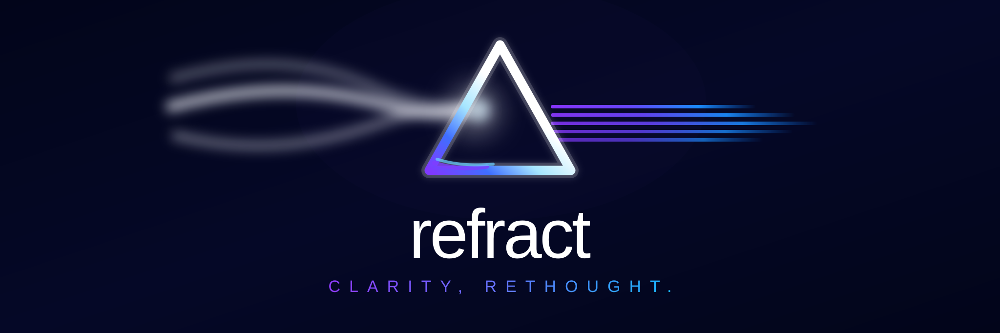

<p align="center">
  
</p>

<p align="center">
  <strong>An experimental gaze-aware adaptive display prototype built with computational optics, computer vision, and real-time GPU rendering.</strong>
</p>

<p align="center">
  Electron · React · TypeScript · WebGL2 · GLSL · MediaPipe · Zustand
</p>

Refract explores a simple question: **what if the screen could adapt to the user's vision instead of making the user adapt to the screen?**

The desktop application captures the display, models an approximate refractive blur from prescription and calibration parameters, tracks the user's gaze or cursor, and applies localized GPU-accelerated image correction around the point of attention. The result is a working engineering prototype that connects optics, computer vision, desktop systems, graphics programming, physical calibration, and user-centered design.

> [!IMPORTANT]
> **Refract is an experimental research and engineering prototype.** It is not a medical device, a clinical diagnostic tool, or a replacement for glasses, contact lenses, professional eye examinations, or other vision care. The guided vision workflow produces heuristic estimates only.

<p align="center">
  
</p>

## Why Refract?

Glasses correct light after it leaves a display. Refract investigates the inverse idea: whether the image on the display can be preprocessed so that some of the user's optical blur is partially compensated before the image reaches the eye.

That idea quickly became more than an image-filtering problem. A useful prototype also had to understand screen scale and viewing distance, convert prescription values into a directional blur model, follow where the user is looking, modify arbitrary desktop content with low latency, avoid visual artifacts, and remain comfortable enough to use.

The project therefore sits at the intersection of several fields:

- **Computational optics:** translate sphere, cylinder, axis, pupil size, viewing distance, and screen scale into an approximate point spread function.
- **Computer vision:** estimate gaze from webcam iris landmarks and calibrate those measurements to screen coordinates.
- **GPU graphics:** perform localized convolution on a live desktop texture with WebGL2 and GLSL.
- **Desktop engineering:** coordinate Electron windows, screen capture, IPC, persistence, system tray controls, shortcuts, and packaging.
- **Human-centered design:** test the prototype with users, identify where the experience fails, and change the product rather than simply collecting feedback.

## What the prototype does

A typical Refract workflow is:

1. **Enter a known prescription or use the experimental guided vision workflow.**
2. **Calibrate physical conditions**, including viewing distance and screen scale.
3. **Build an approximate optical blur model** for the entered refractive values.
4. **Calibrate attention tracking** through gaze or use cursor tracking as a deterministic alternative.
5. **Generate a correction kernel** and send the relevant state to the desktop overlay.
6. **Capture the live desktop and process it on the GPU**, applying correction only around the point of attention.
7. **Control the effect without interrupting other applications** through a click-through overlay, system tray, and global shortcuts.

This architecture lets Refract affect content outside its own React interface. The correction layer is a separate transparent Electron window that can sit over normal desktop applications while allowing mouse interaction to pass through to the software underneath.

## My role

Refract began as a **collaborative project**, and I do not present the original core codebase as solo work. My contribution combined product thinking, user research, iteration, product communication, and later engineering refinement.

| Area | My contribution |
| --- | --- |
| Product direction | Helped frame the project around a human question, adaptive display comfort, rather than around a technology demonstration alone |
| User testing | Helped organize testing, interpret feedback, and identify recurring friction in calibration, reversibility, and correction strength |
| UX iteration | Helped move the before/after experience earlier, simplify calibration language, emphasize reset and reversibility, and prioritize comfort over maximum correction |
| Interface refinement | Later Git history records my work improving typography, spacing, responsive behavior, accessibility labels, OD/OS help graphics, and Refract branding |
| Desktop polish | Added the Refract application and tray icon system, icon-generation tooling, and Windows packaging support |
| Portfolio curation | Migrated the working application into this public showcase repository, removed development-only clutter and sensitive configuration, and documented the project as a technical portfolio |

The original development history is preserved in the [source repository](https://github.com/VDuckardtt/refract). This portfolio repository is a curated presentation of the working project and its engineering story.

## System architecture

Refract separates the desktop interface from the correction layer.

- The **React renderer** handles prescription input, calibration, vision workflow screens, settings, and user controls.
- The **Electron main process** owns desktop windows, persistence, system tray behavior, shortcuts, and IPC.
- The **overlay renderer** receives compact correction state and runs a high-frequency WebGL render loop without forcing React component re-renders.
- The **computer-vision pipeline** produces gaze and distance estimates.
- The **optics pipeline** converts refractive parameters into PSF and correction kernels that can be serialized through IPC.

This separation matters because the application UI and the desktop correction effect have very different performance and interaction requirements.

### Real-time desktop correction

The overlay is a frameless, transparent, always-on-top Electron window. It is normally non-focusable and click-through, so the corrected region can appear over other applications without blocking normal interaction.

Each active frame follows the same path:

```text
desktop video stream
        |
        v
GPU texture upload
        |
        +---- correction kernel
        |
        +---- gaze or cursor coordinate
        |
        v
WebGL2 fragment shader
        |
        v
transparent corrected overlay
```

A subtle systems problem appears immediately: if the screen-capture pipeline captures Refract's own overlay, the app can process its previous corrected output again on the next frame. That creates a recursive feedback loop. The overlay therefore uses Electron content protection so it remains visible to the user while being excluded from capture APIs.

The shader also includes several perceptual safeguards:

- correction fades smoothly outside the focal region instead of ending at a hard edge
- only luminance is replaced after conversion to YCbCr, which reduces color fringing
- a brightness floor limits darkening caused by negative kernel sidelobes
- pixels outside the active region remain transparent, leaving the real desktop untouched
- gaze coordinates are validated before use, with screen center as a safe fallback

These details became important because a mathematically stronger correction was not always a visually better one.

## Gaze tracking and calibration

<p align="center">
  
</p>

The current gaze pipeline does more than call a tracking library. MediaPipe Face Mesh provides iris and eye-corner landmarks, but Refract builds the screen mapping itself.

For each eye, the tracker measures the iris center **relative to the midpoint and width of the eye corners**. This normalized feature reduces the effect of head translation and viewing-distance changes compared with regressing directly on raw camera pixels. Features from both eyes are then combined.

Calibration uses a 3 x 3 grid. A recent-frame median is recorded at each point to reduce blink and micro-saccade noise. Refract then fits two degree-2 polynomial mappings, one for horizontal screen position and one for vertical position, using the feature vector:

```text
[1, x, y, x^2, xy, y^2]
```

The least-squares normal equations are solved with a custom Gauss-Jordan implementation using partial pivoting. During runtime, a constant-velocity Kalman smoother stabilizes the predicted screen coordinate, with additional logic for rapid gaze changes.

After calibration, four validation targets provide a mean pixel-error estimate. This makes tracking quality visible rather than treating successful model initialization as proof of accurate gaze estimation.

## Modeling refractive blur

<p align="center">
  
</p>

Refract currently uses a pragmatic optical approximation designed for real-time experimentation.

Prescription values are converted into blur radii in screen pixels using viewing distance, screen pixel density, and pupil diameter. Sphere contributes the base refractive blur. Cylinder and axis make that blur directional. The result becomes a **rotated anisotropic Gaussian point spread function (PSF)**.

For each kernel sample, Refract rotates the pixel offset into the PSF's principal-axis coordinate system and evaluates a 2D Gaussian. The kernel is normalized to preserve energy, then automatically sized to cover the modeled blur while remaining computationally bounded.

The active correction route derives a normalized unsharp kernel:

```text
correction = (1 + strength) * identity - strength * PSF
```

This is deliberately an approximation. It is fast enough for a live desktop overlay and proved easier to keep visually stable than more aggressive inverse filtering.

### Experimental Wiener inversion

The codebase also contains a separate experimental **frequency-domain Wiener deconvolution** implementation. It zero-pads and shifts the PSF, performs a custom separable 2D discrete Fourier transform, applies the regularized inverse

```text
W(u,v) = H*(u,v) / (|H(u,v)|^2 + NSR)
```

and transforms the result back into a spatial correction kernel.

That implementation is useful as an engineering experiment, but it is **not the current default live path**. The active application uses the faster unsharp approximation. Refract also explored higher-order aberration models during research, including Zernike representations, but the current PSF implementation is Gaussian rather than Zernike-based.

That distinction is intentional in this portfolio: explored techniques, experimental code, and active runtime behavior are documented separately.

## Experimental vision workflow

Refract includes a guided workflow for users who do not begin with prescription values. It is best understood as an experimental calibration interface, not as a clinical eye examination.

The workflow includes:

- **Viewing-distance calibration:** manual positioning plus camera-based estimation.
- **Physical screen calibration:** an ISO-size credit card can be used as a known real-world reference to estimate pixels per millimetre.
- **Snellen-style acuity testing:** Sloan letters from 20/200 through 20/20, scaled using the calibrated physical screen size.
- **Astigmatism clock:** selectable orientations are combined with circular averaging to estimate a dominant axis.
- **Astigmatism fan:** a denser directional refinement interface.
- **Contrast comparison:** generated Gabor-like patches for exploratory visual comparison.
- **Results:** a clearly labeled heuristic estimate that can seed the correction controls.

The physical calibration work was especially important. A vision test cannot rely only on CSS pixels because a letter that is the correct size on one monitor may be physically much larger or smaller on another.

## User testing and iteration

<p align="center">
  
</p>

The early testing process produced **75 initial survey responses** and a later follow-up of approximately **50 respondents**. In that follow-up, **93% reported that they were still using Refract**, while **22% reported that they had shared it with someone else**.

These are exploratory, self-reported survey results. They are not product telemetry, controlled retention measurements, or evidence of clinical efficacy.

The more valuable result was how feedback changed the product:

| What users revealed | What changed |
| --- | --- |
| Calibration instructions sounded too technical | Language was rewritten to behave more like guided setup and less like a clinical test |
| The idea remained abstract until users toggled correction on and off | The before/after comparison was moved earlier so the central concept became tangible sooner |
| Some users worried that a poor adjustment might leave them stuck with a worse screen | Reset and reversibility became more visible |
| Stronger correction could feel harsh or slightly disorienting | Correction strength was reduced and comfort became part of the definition of functionality |
| Setup conditions varied between testers | Viewing distance, room conditions, and calibration environment were recognized as variables that needed more deliberate control |

One of the most useful comments came from a glasses-wearing tester who described the effect as **"promising, but not quite like my glasses."** That was more informative than simply treating technical sophistication as evidence that the experience worked.

## Engineering challenges and decisions

### 1. Preventing recursive capture

**Problem:** a transparent correction layer can accidentally become part of the next desktop frame it processes.

**Decision:** separate correction into its own protected overlay window and exclude that window from capture.

**Lesson:** real-time graphics systems create feedback and timing problems that do not appear in an isolated image-processing prototype.

### 2. Stabilizing gaze without specialized eye-tracking hardware

**Problem:** raw iris positions move with both gaze and head motion, while blinks and micro-movements add noise.

**Decision:** normalize iris position relative to eye geometry, collect multiple calibration samples, fit a polynomial screen mapping, and smooth runtime predictions.

**Lesson:** integrating a computer-vision model is only the first step. A usable system needs calibration, error handling, validation, and temporal filtering around the model.

### 3. Balancing mathematical strength with visual comfort

**Problem:** aggressive sharpening can create ringing, darkening, color artifacts, or an uncomfortable focal region.

**Decision:** keep the real-time path conservative, localize correction around attention, blend its edge, preserve chroma, and protect brightness.

**Lesson:** for a human-facing system, perceptual quality is part of technical correctness.

## Prototype scope and current limitations

Refract is intentionally presented here as a prototype, including the areas that still need work:

- the current real-time correction model uses an anisotropic Gaussian PSF, not a clinically calibrated wavefront model
- the experimental Wiener module exists separately, while the active correction path currently uses unsharp filtering
- the app computes separate OD and OS optical state, but the current overlay path still consumes the OD correction kernel
- the guided Snellen, astigmatism, and contrast stages require more rigorous scoring, integration, and validation before they should be treated as a reliable prescription estimator
- some advanced settings and adaptive-quality hooks are prototype infrastructure rather than fully completed user-facing behavior
- MediaPipe runtime assets are currently loaded from a CDN
- user testing was exploratory and was not conducted under controlled clinical conditions

The limitations are part of the engineering record rather than something to hide. They define the boundary between a compelling proof of concept and the much higher standard required for a validated vision product.

## What I learned

Refract changed how I think about building technically ambitious products.

**Test earlier.** We waited too long to put rough versions in front of users. Research can justify an idea, but it cannot tell you whether a first-time user understands the interface or finds the result comfortable.

**Design the environment, not only the interface.** Viewing distance, screen brightness, room lighting, camera position, and physical screen dimensions can all change the result. In a system connected to the physical world, setup conditions are part of the product.

**Define success before collecting feedback.** Early testing mixed several possible definitions of "working," including perceived sharpness, comfort, visible before/after difference, and similarity to glasses. Clear success criteria would have made the evaluation more rigorous.

**Technical complexity is not a substitute for clarity.** A shader, deconvolution method, or tracking model can be sophisticated while the user experience is still confusing. The most useful feedback often came from simple observations about what users could actually see and understand.

**Comfort is part of functionality.** More correction was not automatically better correction. The project became stronger when the goal shifted from maximizing an effect to building something predictable and usable.

## Technology

| Area | Technology and implementation |
| --- | --- |
| Desktop application | Electron 32, Electron Vite |
| Interface | React 18, TypeScript, React Router, Tailwind CSS |
| State and persistence | Zustand, electron-store |
| GPU rendering | WebGL2, GLSL ES 3.00 |
| Computer vision | MediaPipe Face Mesh with custom iris-feature calibration |
| Gaze estimation | Degree-2 polynomial regression, custom Gauss-Jordan solver, Kalman smoothing |
| Computational optics | Directional Gaussian PSFs, normalized unsharp correction, experimental Wiener deconvolution |
| Desktop integration | IPC, transparent overlay, desktop capture, tray controls, global shortcuts |
| Packaging | Electron Builder, Windows NSIS, macOS DMG, Linux AppImage |

## Run Refract locally

### Prerequisites

- Node.js and npm
- A desktop environment supported by Electron
- A webcam for eye tracking and camera-based distance estimation
- Screen-capture permission where required by the operating system

### Development

```bash
git clone https://github.com/kzhu37/Refract-Portfolio.git
cd Refract-Portfolio
npm ci
npm run dev
```

### Verification

```bash
npm run typecheck
npm run build
```

### Platform packages

```bash
npm run build:win
npm run build:mac
npm run build:linux
```

Build the target that matches your operating system. Platform-specific packaging can require native tooling and permissions.

### Global shortcuts

| Action | Windows / Linux | macOS |
| --- | --- | --- |
| Toggle correction | `Ctrl + Shift + V` | `Cmd + Shift + V` |
| Bring Refract forward | `Ctrl + Shift + B` | `Cmd + Shift + B` |

## Repository guide

```text
src/
  main/
    ipc/                 Electron IPC handlers
    store/               Persistent application state
    tray/                System tray integration
    windows/             Main and transparent overlay windows
  overlay/
    lib/capture/         Live desktop capture
    lib/quality/         Frame-time monitoring
    lib/webgl/           Shader and WebGL renderer
    CorrectionCanvas.tsx High-frequency correction loop
  preload/               Context-isolated Electron bridges
  renderer/
    components/          Calibration, vision, and correction UI
    lib/eyetracking/     Iris tracking, calibration, smoothing
    lib/optics/          Prescription model, PSF, Wiener experiments
    lib/store/           Renderer state
    pages/               Main application screens

docs/media/              Portfolio diagrams and visual documentation
resources/icons/         App and tray branding
scripts/                 Icon generation tooling
```

## Project status and next steps

The current repository is a functional prototype and a record of the engineering exploration behind it. The most meaningful future work is not adding more controls. It is improving validation and closing the gap between promising computation and reliable human results.

Priorities include:

1. integrate OD and OS correction behavior more rigorously
2. connect astigmatism and contrast measurements to a better-defined evaluation pipeline
3. add automated tests for optics, scoring, and calibration math
4. benchmark latency and visual quality under controlled viewing conditions
5. package MediaPipe assets locally for a more self-contained application
6. compare Gaussian, Wiener, and higher-order optical models with predefined success criteria
7. conduct structured testing under controlled screen distance, brightness, and room lighting

## Collaboration and credits

Refract was developed collaboratively by Vlad and me. The original development repository is [VDuckardtt/refract](https://github.com/VDuckardtt/refract), and this repository is my curated portfolio version of the project.

Our development process combined research, prototyping, testing, and iteration across several disciplines. We started with the question of whether a display could adapt to a user's vision, then worked through the practical problems required to make that idea function as a real desktop prototype. That meant moving repeatedly between optical modeling, gaze tracking, interface design, real-time rendering, calibration, and user feedback rather than treating them as isolated parts.

The project's technical difficulty came less from any one library or algorithm than from making those systems operate together. Prescription and calibration data had to become a usable correction model; webcam iris landmarks had to become stable screen coordinates; those coordinates had to drive a localized GPU correction over a continuously captured desktop; and the whole pipeline had to remain responsive, reversible, and understandable enough for users to test. Integrating computational optics, computer vision, WebGL/GLSL rendering, and Electron desktop systems into one working loop is what turned Refract from a collection of technical experiments into a complete engineering prototype.