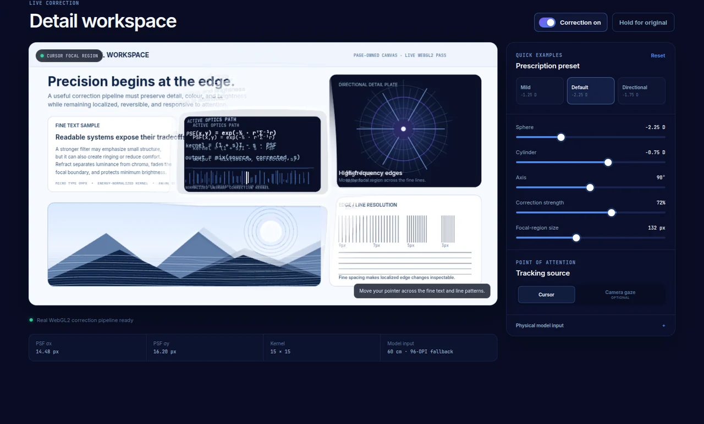

<p align="center">
  
</p>

<p align="center">
  <strong>An experimental adaptive-display prototype combining computational optics, gaze tracking, physical calibration, and real-time GPU rendering.</strong>
</p>

<p align="center">
  Electron · React · TypeScript · WebGL2 · GLSL · MediaPipe · Zustand
</p>

<p align="center">
  <a href="https://refract-portfolio.vercel.app"><strong>Try the interactive browser demo</strong></a>
  &nbsp;·&nbsp;
  <a href="#system-architecture"><strong>Explore the engineering</strong></a>
  &nbsp;·&nbsp;
  <a href="#contribution-and-collaboration"><strong>Contribution</strong></a>
</p>

<p align="center">
  <a href="https://github.com/kzhu37/Refract-Portfolio/actions/workflows/ci.yml"></a>
  <a href="https://github.com/kzhu37/Refract-Portfolio/actions/workflows/production-smoke.yml"></a>
</p>

Refract explores a simple question: **what if the screen could adapt to the user's vision instead of making the user adapt to the screen?**

The full Electron prototype captures display content, builds an approximate refractive-blur model from prescription and physical calibration parameters, follows a cursor or calibrated gaze estimate, and applies localized GPU correction around the point of attention. The project became a systems problem spanning optics, numerical methods, computer vision, desktop capture, WebGL, physical geometry, and human comfort.

> [!IMPORTANT]
> **Refract is an experimental research and engineering prototype.** It is not a medical device, a clinical diagnostic tool, or a replacement for glasses, contact lenses, professional eye examinations, or other vision care. The guided workflow produces heuristic estimates only.

## See the correction pipeline work

<table>
  <tr>
    <td width="50%">
      
    </td>
    <td width="50%">
      
    </td>
  </tr>
  <tr>
    <td align="center"><sub><strong>Original:</strong> correction disabled.</sub></td>
    <td align="center"><sub><strong>Correction active:</strong> the shared optics and WebGL2 path processes a localized focal region.</sub></td>
  </tr>
</table>

The deployed demo reuses Refract's browser-compatible PSF generation, correction-kernel generation, and WebGL renderer rather than substituting a static visual effect. Cursor tracking works immediately, while camera gaze is optional.

### The full system is a desktop application

<p align="center">
  
</p>

The browser demo is a public window into the browser-compatible core. It cannot capture arbitrary desktop content or place Refract's transparent overlay above other applications. The full Electron prototype retains system-level desktop capture, a protected transparent overlay, physical screen calibration, persistent settings, tray controls, global shortcuts, and the full 3 x 3 gaze-calibration flow.

## At a glance

| Area | Current prototype |
| --- | --- |
| **Core idea** | Preprocess display content so the screen can partially compensate for modeled visual blur |
| **Technical centerpiece** | A gaze-aware or cursor-aware WebGL2 correction region rendered through a transparent, click-through Electron overlay |
| **Optical model** | Sphere, cylinder, axis, viewing distance, screen scale, and pupil assumptions become a rotated anisotropic Gaussian point spread function |
| **Tracking** | MediaPipe iris landmarks, eye-relative features, polynomial screen calibration, validation, and Kalman smoothing |
| **Desktop systems** | Screen capture, protected overlay, IPC, persistence, tray controls, global shortcuts, and packaging |
| **Verification** | Focused numerical tests, TypeScript checks, desktop and browser builds, plus production interaction smoke tests |
| **Project type** | Collaborative experimental engineering prototype with later public refinement, documentation, and browser adaptation |

<p align="center">
  <a href="#why-refract">Why</a> ·
  <a href="#system-architecture">Architecture</a> ·
  <a href="#gaze-tracking-and-calibration">Gaze</a> ·
  <a href="#modeling-refractive-blur">Optics</a> ·
  <a href="#guided-vision-workflow">Workflow</a> ·
  <a href="#testing-changed-the-product">Testing</a> ·
  <a href="#verification">Verification</a> ·
  <a href="#run-refract-locally">Run locally</a>
</p>

## Why Refract

Glasses correct light after it leaves a display. Refract investigates the inverse idea: whether displayed content can be preprocessed so that some modeled optical blur is partially compensated before the image reaches the eye.

A useful prototype had to do far more than sharpen an image. It had to connect pixels to physical screen dimensions, account for viewing distance, translate prescription values into directional blur, follow a point of attention, process changing desktop content continuously, prevent the output from feeding back into the next captured frame, control artifacts, and remain comfortable enough to test.

That turned the project into an integration problem across several systems:

- **Computational optics:** convert refractive and physical parameters into an approximate point spread function.
- **Computer vision:** estimate gaze from webcam iris landmarks and calibrate those measurements to screen coordinates.
- **Numerical methods:** fit screen mappings, condition noisy data, smooth predictions, and generate bounded kernels.
- **GPU graphics:** run localized convolution on a continuously updated texture with WebGL2 and GLSL.
- **Desktop engineering:** coordinate Electron windows, capture, IPC, persistence, tray controls, shortcuts, and packaging.
- **Human-centered iteration:** treat comprehension, reversibility, setup conditions, and visual comfort as engineering constraints.

## System architecture

<p align="center">
  
</p>

Refract separates its application interface from the high-frequency correction layer because they have different performance and interaction requirements.

- The **React renderer** handles prescription input, calibration, the guided workflow, settings, and user controls.
- The **Electron main process** owns windows, screen-capture coordination, persistence, tray behavior, global shortcuts, and IPC.
- The **overlay renderer** receives compact correction state and runs a WebGL render loop without forcing React component re-renders.
- The **tracking pipeline** supplies a cursor position or calibrated gaze estimate.
- The **optics pipeline** converts refractive and physical parameters into PSF and correction kernels that can be serialized through IPC.

```text
prescription + physical calibration
              |
              v
       approximate optical model
              |
              +----------------------+
              |                      |
              v                      v
       correction kernel      gaze or cursor
              |                      |
              +----------+-----------+
                         |
                         v
                  desktop capture
                         |
                         v
               WebGL2 correction shader
                         |
                         v
             transparent desktop overlay
```

### Real-time desktop correction

The correction layer is a separate frameless, transparent, always-on-top Electron window. It is normally non-focusable and click-through, so the corrected region can appear above other applications without intercepting normal mouse input.

The high-frequency path lives in [`CorrectionCanvas.tsx`](src/overlay/CorrectionCanvas.tsx), with the renderer in [`webgl-utils.ts`](src/overlay/lib/webgl/webgl-utils.ts) and shader logic in [`correction-shader.ts`](src/overlay/lib/webgl/correction-shader.ts).

One subtle systems problem appears immediately. If screen capture includes Refract's own overlay, the next frame can contain the previous corrected output. Reprocessing that output creates a recursive feedback loop. [`overlay-window.ts`](src/main/windows/overlay-window.ts) uses Electron content protection so the overlay stays visible to the user while remaining excluded from capture APIs.

The shader adds several perceptual safeguards:

- correction fades smoothly outside the focal region instead of ending at a hard boundary
- processing changes luminance while retaining the source chroma to reduce color fringing
- a brightness floor limits darkening from negative kernel sidelobes
- pixels outside the active region remain transparent, leaving the underlying desktop untouched
- non-finite gaze coordinates are rejected before they can contaminate shader state

The central lesson was practical: a mathematically stronger filter is not automatically a better human-facing result.

## Gaze tracking and calibration

<p align="center">
  
</p>

Cursor tracking is the default because it works immediately and requires no camera. Eye tracking is optional and adds a more difficult calibration problem.

MediaPipe Face Mesh supplies iris and eye-corner landmarks, but Refract does not treat those landmarks as a finished gaze estimate. In [`iris-gaze.ts`](src/renderer/lib/eyetracking/iris-gaze.ts), each iris center is measured **relative to the midpoint and width of its eye corners**. This eye-relative feature reduces sensitivity to head translation and viewing-distance changes compared with regressing directly on raw camera pixels.

Desktop calibration uses a 3 x 3 screen grid. At each target, Refract records the median of several recent feature samples to reduce the influence of blinks and small involuntary movements. It then builds second-degree polynomial features:

```text
[1, x, y, x^2, xy, y^2]
```

Separate horizontal and vertical mappings are fitted with least squares. The normal equations are solved by a custom Gauss-Jordan routine with partial pivoting, while feature centering and scaling improve numerical conditioning. Runtime predictions then pass through the constant-velocity Kalman smoother in [`gaze-smoother.ts`](src/renderer/lib/eyetracking/gaze-smoother.ts).

The calibration flow also uses separate validation targets to estimate screen-space error. That distinction matters because successful model initialization is not evidence that the mapping is accurate.

## Modeling refractive blur

<p align="center">
  
</p>

The active optical model is deliberately pragmatic. Refract converts prescription and calibration values into blur radii in screen pixels using viewing distance, screen pixel density, and pupil assumptions. Sphere contributes the base blur, while cylinder and axis create directional behavior. The result is a **rotated anisotropic Gaussian point spread function (PSF)**.

Prescription conversion is implemented in [`prescription.ts`](src/renderer/lib/optics/prescription.ts), while PSF and live correction-kernel generation live in [`psf.ts`](src/renderer/lib/optics/psf.ts).

For each PSF sample, Refract rotates the pixel offset into the kernel's principal-axis coordinate system, evaluates a 2D Gaussian, and normalizes the result. Kernel dimensions remain bounded so the live path stays practical.

### One clear meaning for correction strength

The live route generates one full-strength spatial unsharp kernel:

```text
K = 2I - PSF
```

The WebGL shader owns the single user-facing strength blend between the original and corrected luminance. Keeping strength out of cached kernel generation avoids stale kernel state when the slider changes and gives the control one consistent meaning.

### Experimental inversion work

The codebase also contains a separate frequency-domain Wiener experiment in [`wiener.ts`](src/renderer/lib/optics/wiener.ts):

```text
W(u,v) = H*(u,v) / (|H(u,v)|^2 + NSR)
```

It pads and shifts the PSF, performs a custom separable 2D discrete Fourier transform, applies a regularized inverse, and transforms the result back into a spatial kernel.

That experiment is intentionally **not presented as an active runtime control**. Higher-order optical representations, including Zernike-based ideas, were also explored during research, but the current live model remains Gaussian. Keeping research experiments separate from active behavior makes the interface and documentation more credible.

## Guided vision workflow

Refract can begin from a known prescription, but it also contains an experimental guided workflow for users who do not start with one. This is a calibration and interaction experiment, not a clinical eye examination.

<table>
  <tr>
    <td width="50%">
      
    </td>
    <td width="50%">
      
    </td>
  </tr>
  <tr>
    <td align="center"><sub>Known OD and OS values stay explicit and editable.</sub></td>
    <td align="center"><sub>Sloan-style letters are scaled from physical screen calibration rather than CSS pixels alone.</sub></td>
  </tr>
</table>

The workflow includes:

- **Viewing-distance calibration:** manual positioning plus camera-based estimation.
- **Physical screen calibration:** an ISO-size credit card can serve as a known real-world reference for estimating pixels per millimetre.
- **Snellen-style acuity testing:** Sloan letters from 20/200 through 20/20, scaled from calibrated physical screen size.
- **Astigmatism clock:** selectable orientations combined through circular averaging to estimate a dominant axis.
- **Astigmatism fan:** a denser directional refinement interface.
- **Contrast comparison:** generated Gabor-like patches for exploratory visual comparison.
- **Results:** a clearly labeled heuristic estimate that can seed correction controls.

Physical calibration became a central engineering constraint. A letter occupying the same number of CSS pixels can have very different real-world dimensions on two monitors, so screen geometry and viewing conditions belong inside the model rather than only in setup instructions.

## How the project developed

| Stage | What changed |
| --- | --- |
| **1. Initial question** | Started with the idea of compensating modeled visual blur in displayed content |
| **2. Systems prototype** | Connected refractive parameters, gaze or cursor tracking, desktop capture, a transparent overlay, and GPU correction |
| **3. Early testing** | Revealed that technical functionality alone did not make the system understandable, comfortable, or trustworthy |
| **4. Product iteration** | Moved comparison earlier, made reset and reversibility clearer, reduced aggressive defaults, rewrote calibration guidance, and treated physical conditions as explicit variables |
| **5. Public prototype** | Added a browser-scoped interactive demonstration, clearer scope boundaries, truthful runtime controls, numerical tests, deployment checks, and technical documentation |

## Testing changed the product

<p align="center">
  
</p>

Exploratory user testing exposed problems that code review alone could not reveal.

| What users revealed | What changed |
| --- | --- |
| Calibration language sounded too technical | Instructions were rewritten as guided setup rather than a clinical-sounding procedure |
| The idea remained abstract until users toggled correction on and off | Before-and-after comparison moved earlier so the core effect became tangible sooner |
| Some users worried a poor adjustment might leave the screen worse | Reset and reversibility became more visible |
| Stronger correction could feel harsh or slightly disorienting | Default strength was reduced and comfort became part of the definition of functionality |
| Results varied with the testing environment | Viewing distance, brightness, room lighting, camera position, and physical screen dimensions became explicit engineering variables |

One glasses-wearing tester described the result as **"promising, but not quite like my glasses."** That feedback was useful because it separated a visible effect from genuine effectiveness and pushed the project toward clearer limits, better setup, and more meaningful success criteria.

The testing was exploratory and subjective. It was not controlled clinical validation and cannot establish that Refract can replace corrective lenses.

## Engineering challenges and decisions

| Challenge | Decision | Why it mattered |
| --- | --- | --- |
| Recursive screen capture | Protect the transparent overlay from capture APIs | Prevents corrected output from feeding back into the next frame |
| Noisy webcam gaze | Normalize iris position to eye geometry, collect multiple samples, fit and validate a polynomial mapping, then smooth it | Turns raw landmarks into a more stable screen coordinate |
| Sharpening artifacts and discomfort | Localize correction, blend the boundary, preserve chroma, protect brightness, and keep defaults conservative | Treats perceptual quality as part of correctness |
| Inconsistent physical display scale | Calibrate screen scale and viewing distance | Connects CSS and screen pixels to real-world geometry |
| Prototype controls that could overstate functionality | Expose only controls wired to active runtime behavior | Keeps the interface aligned with what the renderer actually does |

## Verification

Refract verifies the numerical core, the builds, and the deployed browser interaction as separate concerns.

### Numerical checks

`npm test` compiles and runs focused deterministic checks covering:

- anisotropic Gaussian-kernel normalization and finite output
- identity behavior for an emmetropic prescription
- directional response when cylinder and axis are present
- prescription cylinder-form normalization
- correction-kernel normalization and single strength semantics
- Kalman gaze-smoother stability and reset behavior

These tests target invariants in the numerical code rather than using a coverage percentage as a substitute for meaningful checks.

### Build and production checks

GitHub Actions:

- type-checks the Node, renderer, and browser-demo targets
- runs the numerical test suite
- builds the Electron application
- builds the isolated browser demo
- verifies README media references and portfolio writing constraints
- checks the deployed demo for an HTTP 200 response
- requires WebGL2 initialization in the production browser path
- verifies that pointer movement changes the rendered correction-stage output
- exercises correction toggling, presets, reset behavior, responsive layout, WebGL fallback, camera-consent UI, and deep-link loading
- fails on severe browser-console errors during the production smoke path

This separates three questions that are easy to blur together: does the math preserve expected invariants, does the code build, and does the deployed interaction actually behave as intended?

## Prototype scope and current limitations

Refract is a proof of concept with clear boundaries:

- the live optical model uses an anisotropic Gaussian PSF, not a clinically calibrated wavefront model
- the experimental Wiener module remains separate, while the active route uses normalized unsharp correction
- the application computes separate OD and OS optical states, but the current screen-level renderer applies one selected eye profile at a time rather than simultaneous binocular per-eye correction
- the guided acuity, astigmatism, and contrast stages remain heuristic and need more rigorous scoring and validation before they could support reliable prescription estimation
- adaptive-quality monitoring exists, but automatic resolution adjustment is not yet part of the user-facing behavior
- MediaPipe runtime assets are currently loaded from a CDN
- user testing was exploratory and was not performed under controlled clinical conditions

These limitations define where the prototype ends and where future engineering and validation would have to begin.

## What I learned

**Test earlier.** Research can justify a direction, but it cannot show whether a first-time user understands the setup or finds the result comfortable.

**Design the environment, not only the interface.** Viewing distance, brightness, room lighting, camera position, and physical screen dimensions can change the result. In software connected to the physical world, setup conditions become system inputs.

**Define success before collecting feedback.** Early testing mixed several possible meanings of "working," including visible sharpness, comfort, before-and-after difference, and similarity to corrective lenses. Stronger evaluation starts by defining those criteria.

**Technical complexity is not a substitute for clarity.** A shader, inverse-filtering experiment, or tracking model can be sophisticated while the product remains confusing.

**Comfort is part of functionality.** More correction was not automatically better correction. The goal became a result that was predictable, reversible, and usable.

## Technology

| Area | Technology and implementation |
| --- | --- |
| Desktop application | Electron 32, Electron Vite |
| Interface | React 18, TypeScript, React Router, Tailwind CSS |
| State and persistence | Zustand, electron-store |
| GPU rendering | WebGL2, GLSL ES 3.00 |
| Computer vision | MediaPipe Face Mesh with custom iris-feature calibration |
| Gaze estimation | Degree-2 polynomial regression, custom Gauss-Jordan solver, Kalman smoothing |
| Computational optics | Directional Gaussian PSFs, normalized unsharp correction, experimental Wiener deconvolution |
| Desktop integration | IPC, transparent overlay, desktop capture, tray controls, global shortcuts |
| Packaging | Electron Builder, Windows NSIS, macOS DMG, Linux AppImage |
| Verification | TypeScript checks, focused numerical tests, GitHub Actions, production browser smoke testing |

## Run Refract locally

### Prerequisites

- Node.js 20 or a compatible current Node.js release
- npm
- a desktop environment supported by Electron
- a webcam only for optional eye tracking or camera-based distance estimation
- screen-capture permission where required by the operating system

### Desktop development

```bash
git clone https://github.com/kzhu37/Refract-Portfolio.git
cd Refract-Portfolio
npm ci
npm run dev
```

Cursor tracking is the default and does not require a camera. To use eye tracking, select it in the correction controls and complete calibration.

### Browser demo development

```bash
npm run dev:web-demo
```

The browser target is intentionally scoped to content inside the page. It is not a replacement for the Electron desktop overlay.

### Verification

```bash
npm run typecheck
npm test
npm run build
npm run build:web-demo
```

### Platform packages

```bash
npm run build:win
npm run build:mac
npm run build:linux
```

Build the target matching your operating system. Platform-specific packaging can require native tooling and permissions.

### Global shortcuts

| Action | Windows / Linux | macOS |
| --- | --- | --- |
| Toggle correction | `Ctrl + Shift + V` | `Cmd + Shift + V` |
| Bring Refract forward | `Ctrl + Shift + B` | `Cmd + Shift + B` |

## Repository guide

```text
src/
  main/
    ipc/                 Electron IPC handlers
    store/               Persistent application state
    tray/                System tray integration
    windows/             Main and transparent overlay windows
  overlay/
    lib/capture/         Live desktop capture
    lib/quality/         Frame-time monitoring
    lib/webgl/           Shader and WebGL renderer
    CorrectionCanvas.tsx High-frequency correction loop
  preload/               Context-isolated Electron bridges
  renderer/
    components/          Calibration, vision, and correction UI
    lib/eyetracking/     Iris tracking, calibration, smoothing
    lib/optics/          Prescription model, PSF, Wiener experiment
    lib/store/           Renderer state
    pages/               Main application screens
web-demo/                Interactive browser adaptation
tests/                   Focused numerical verification
docs/media/              Screenshots and diagrams
resources/icons/         App and tray branding
scripts/                 Icon-generation tooling
```

## Next steps

The strongest next work is deeper validation rather than adding more controls:

1. develop a principled simultaneous binocular rendering model rather than switching one screen-level eye profile at a time
2. benchmark frame time, latency, calibration error, and visual quality under controlled hardware and viewing conditions
3. expand automated coverage around calibration regression, guided-workflow scoring, and physical screen conversions
4. compare Gaussian, Wiener, and higher-order optical models against predefined visual and numerical success criteria
5. move MediaPipe runtime assets into a controlled local packaging path

## Contribution and collaboration

Refract was developed collaboratively by Vlad Duckardt and Kevin Zhu. The original development history remains available in [`VDuckardtt/refract`](https://github.com/VDuckardtt/refract). This portfolio repository is a cleaned public version that preserves the collaborative boundary while documenting later refinement work clearly.

| Area | Kevin Zhu's role |
| --- | --- |
| **Product direction and evaluation** | Helped frame the project around adaptive-display comfort, organized and interpreted exploratory user testing, and translated recurring feedback into clearer product criteria |
| **Feedback-driven iteration** | Helped move before-and-after comparison earlier, make reset and reversibility more visible, reduce overly aggressive defaults, and treat physical viewing conditions as system variables |
| **Interface and accessibility engineering** | Completed a substantial later application-wide refinement covering typography, spacing, responsive layout, navigation, accessibility semantics, help graphics, and Refract branding |
| **Desktop productization** | Added the Refract app and tray icon system, icon-generation tooling, and Windows packaging support |
| **Public engineering work** | Prepared the public repository, refined the browser adaptation, added diagrams and technical documentation, aligned visible controls with actual runtime behavior, and added automated numerical and production verification |
| **Core prototype** | Developed collaboratively. The original source history remains linked rather than being presented as solo work |

Two source-history commits show parts of the later engineering work directly:

- [`11e9c9c`](https://github.com/VDuckardtt/refract/commit/11e9c9ccb8aee09c7aac5ceb3ed13c75cf4eb80b): interface structure, responsive behavior, accessibility, typography, help graphics, and branding refinement
- [`0fa3a54`](https://github.com/VDuckardtt/refract/commit/0fa3a54b1e7a5d66fe540837c7b16addb130a860): application and tray icons, icon-generation tooling, and Windows packaging support

## Credits and license

Refract was developed collaboratively by Vlad Duckardt and Kevin Zhu. See the [MIT License](LICENSE) for repository licensing.

This public version includes later product refinements, the browser adaptation, technical diagrams, documentation, runtime-credibility cleanup, automated numerical verification, and deployment checks. The project's central difficulty remains the same: refractive parameters have to become a usable computational model, noisy webcam landmarks have to become stable screen coordinates, those coordinates have to drive localized GPU correction over changing content, and the whole loop has to remain responsive, reversible, understandable, and honest about its limits.
